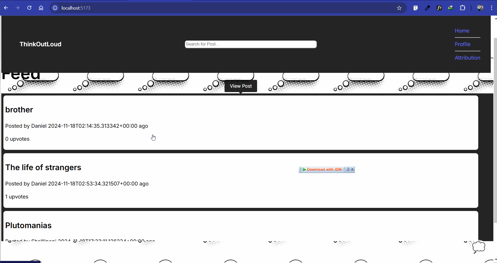

# **ThinkOutLoud: A Social Media Web App**

**ThinkOutLoud**is a React-based social media web app that allows users to create, view, edit, interact with, and delete posts.

**Key Features:**
_Post Creation_: Users can create posts with a title, optional text, and an image via an external URL.
_Home Feed_: Displays all posts with their title, creation time, and upvote count.
_Post Interaction_: Users can sort posts by time or upvotes, search by title, and upvote any number of times.
_Post Pages_: Clicking a post leads to a detailed page with additional content and comments.
_Editing & Deletion_: Posts can be edited or deleted from their individual pages.
_Commenting_: Users can leave comments on post pages.
_Loading Animation_: Displays while fetching data.
_Dark/Light Mode_: Adjusts appearance based on the user’s system settings.

ThinkOutLoud mirrors the functionality of a typical social media platform, offering a seamless and interactive user experience.

## Video Walkthrough

Here's a walkthrough of implemented user stories:

<!-- Replace this with whatever GIF tool you used! -->
GIF created with LiceCap  

## Notes

Nothing Really, will implement profile and stretch Features later

## License

    Copyright [2024] [Daniel Anorue]

    Licensed under the Apache License, Version 2.0 (the "License");
    you may not use this file except in compliance with the License.
    You may obtain a copy of the License at

        http://www.apache.org/licenses/LICENSE-2.0

    Unless required by applicable law or agreed to in writing, software
    distributed under the License is distributed on an "AS IS" BASIS,
    WITHOUT WARRANTIES OR CONDITIONS OF ANY KIND, either express or implied.
    See the License for the specific language governing permissions and
    limitations under the License.
